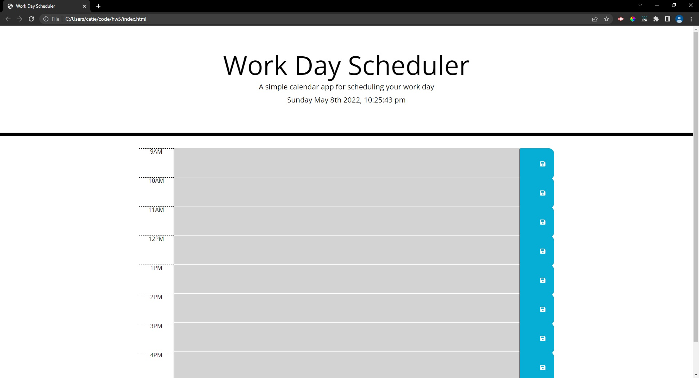

# 05 Third-Party APIs: Work Day Scheduler

## Description

This is a simple calendar application that allows the user to save events for each hour of the day. The user will be able to input an event in a desired time slot and save it by clicking on the save buttons.

## Screenshot

## Links to Application

- Here is the link: [coconnor10/HW5](https://github.com/coconnor10/work-day-scheduler)
- Here is the link to pages: [coconnor10/pages](https://coconnor10.github.io/work-day-scheduler/)
